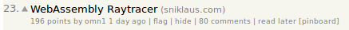
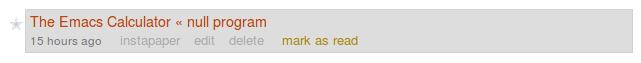

# user-scripts
User scripts that I use with Tampermonkey.

## hacker-news-read-later-pinboard.user.js

Adds an option to add Hacker News links to Pinboard.

## pinboard-instapaper-text.user.js

Adds a link to open a Pinboard bookmark in Instapaper.

## pinboard-youtube-embed.user.js

Show YouTube embeds in Pinboard bookmark view.
